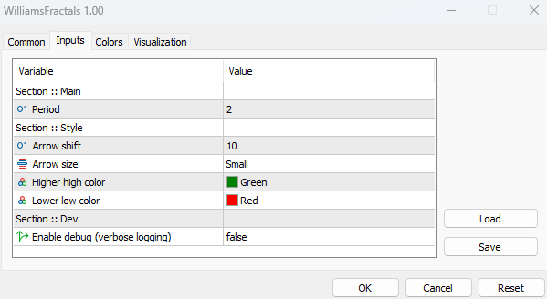
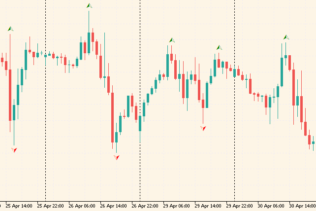

# Forex Williams Fractals Indicator for MT5
Indicator shows Williams fractals in MetaTrader 5.

## Installation
- Open data folder in MetaTrader from menu `File -> Open Data Folder`.
- Copy [WilliamsFractals.mq5](MQL5/Indicators/WilliamsFractals.mq5) file to `<METATRADER_DATA_DIR>\MQL5\Indicators` folder.
- Update the list of indicators on Navigator panel.
- Drag `WilliamsFractals` indicator on the chart.

## Configuration
Available settings of the indicator:

## Usage
Make a trade decision using the indicator:

## Contribution
Feel free to create an issue or a pull request if any ideas.

## Disclaimer
The source code of this repository is provided AS-IS and WITH NO WARRANTY of any kind.
Author and/or contributor are NOT responsible for any type of losses as a result of using source code, 
compiled binaries or other outcomes related to this repository.
